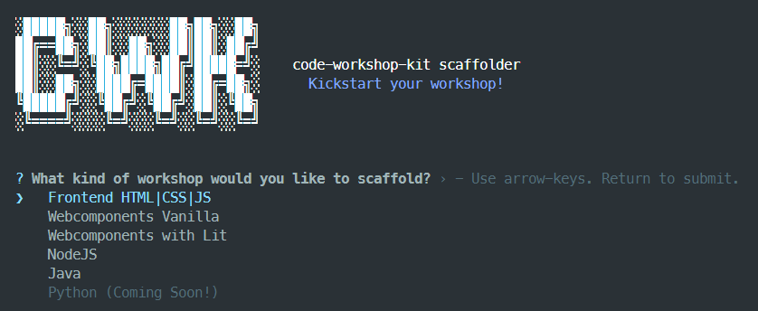
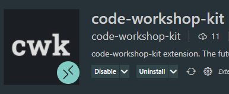

# code-workshop-kit v2

## code-workshop-kit has reached v2 🎉

In this article I will give a quick overview of what has happened in the last quarter.

Summarizing:

- ✨ code-workshop-kit source was migrated to TypeScript
- 🧬 Launch of a new generator for scaffolding specific workshops
- 📘 VS Code extension
- 💬 Slack workspace
- 🍔 Site has a very satisfying mobile hamburger menu

### TypeScript

The entire codebase has been migrated to TypeScript. Prior to this, code-workshop-kit was not strictly typed at all.

Personally, I was more familiar with types from JSDocs, but this time around I decided to try out the full TypeScript workflow.

I am still pretty neutral on which one I prefer but here's what it means for you as a code-workshop-kit user:

- A couple of bugs related to non-strict types were squashed! Very uncommon bugs though, so it's unlikely that you will notice this.
- You can now import things from code-workshop-kit with types attached to them, handy if you want to use CWK by extending parts of it in your NodeJS projects.
- Potentially breaks your code if you were importing from code-workshop-kit NPM package, hence v2.

What this migration also allowed was to create our VS Code extension in TypeScript and allow reusing and importing from CWK with strict types, this was the main trigger for doing this migration.

### CWK Generator

code-workshop-kit now has a generator or scaffolder as some people like to call it.

```sh
npm init code-workshop-kit
```

This is all you have to do now as a host to create a new workshop using code-workshop-kit.

You will be presented with the following menu:



As you can see, I already created a bunch of templates for workshops that I tend to give myself.

```js
class JorenComponent extends HTMLElement {
  connectedCallback() {
    this.innerHTML = '<h2>Hello, Joren! :)</h2>';
  }
}

customElements.define('joren-component', JorenComponent);

export default `<joren-component></joren-component>`;
```

I am super open to contributions to this, this is the [GitHub repository](https://github.com/code-workshop-kit/create).
I haven't written clear contribution guidelines yet but I hope that it is fairly straightforward to add more items by copy pasting, I will help you out with the rest!

You can of course also reach me on the [code-workshop-kit slack](https://join.slack.com/t/code-workshop-kit/shared_invite/zt-p9pfhqzo-tvj_5sWNuxHYT_TJw3t5_g) for questions.

### VS Code extension

In the previous section I explained how the scaffolder allows you to start a workshop super quick.

In addition, there is now an [official code-workshop-kit VS Code extension](https://marketplace.visualstudio.com/items?itemName=code-workshop-kit.code-workshop-kit-extension) that automates some tedious tasks for you:

- Automatically adding Live Share participants to the `cwk.config.js` participants array when they join.
- Automatically scaffold files for each participant when they join, based on your template.

This is made possible by the fact that VS Code extensions can hook into VS Code Live Share lifecycle hooks, which is super cool.
Shoutout to [Jonathan Carter](https://twitter.com/LostInTangent) at Microsoft Live Share team, for bringing the idea up and helping me out!



> Keep in mind however that this extension hasn't yet been battle-tested much by me personally, and is currently in alpha, so expect some bugs and breaking changes.

### Slack

We now have a [Slack workspace](https://join.slack.com/t/code-workshop-kit/shared_invite/zt-p9pfhqzo-tvj_5sWNuxHYT_TJw3t5_g) which is where I'd like code-workshop-kit discussions to take place, as well as Q&A, feature requests, etc. etc.

It is also the easiest and quickest place to reach me, since I am pretty irregular about checking [Twitter](https://twitter.com/jorenbroekema).

### Hamburger menu

I had to add some items to the landing page which did not fit on mobile, so it was time for a hamburger menu 🍔.

I ended up using [Rocket](https://rocket.modern-web.dev/)'s hamburger menu and sidebar, because it has really nice mobile interaction and gesture control.
So thanks to [Thomas Allmer](https://twitter.com/daKmoR) and [Kenneth Christiansen](https://github.com/kenchris) for creating and sharing!

## Want to stay up to date?

Feel free to subscribe with your email address on [our homepage](https://code-workshop-kit.com/index.html#signup), I will email these newsletters to our mailing list.
